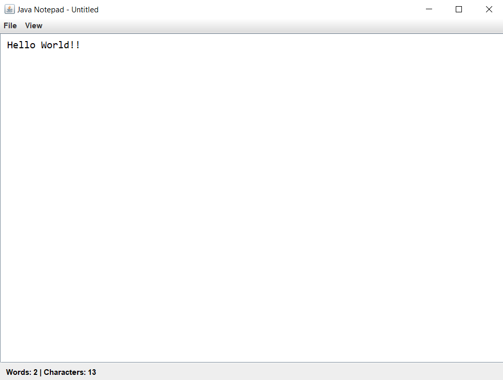

# 🗒️ Java Notepad

A simple, lightweight Notepad clone built using Java Swing. Supports file operations, auto-save, dark mode toggle, and live status updates on word and character count.

---

## 🚀 Features

- 🆕 Create, open, and save `.txt` files
- 🌓 Toggle between light and dark mode
- 💾 Auto-save every 10 seconds (if file exists)
- 🧠 Live word and character counter
- ⌨️ Keyboard shortcuts for quick access
- 📋 Status bar for user feedback

---

## 📸 Screenshots




---

## 🔧 Requirements

- Java JDK 8 or higher
- Any Java IDE (IntelliJ IDEA, Eclipse, NetBeans, etc.)

---

## 🛠️ How to Run

1. Clone this repository:

   ```bash
   git clone https://github.com/Hemant-Mhalsekar/Java-Notepad.git
   cd java-notepad
   ```

2. Compile and run:

   ```bash
   javac Notepad.java
   java Notepad
   ```

---

## ⌨️ Keyboard Shortcuts

| Action       | Shortcut        |
|--------------|-----------------|
| New File     | Ctrl + N        |
| Open File    | Ctrl + O        |
| Save File    | Ctrl + S        |
| Exit         | Ctrl + Q        |

---

## 🌑 Dark Mode

Use the `View -> Toggle Dark Mode` option from the menu bar to switch between dark and light themes.

---

## 📁 File Auto-Save

If you're working on an existing file, the notepad automatically saves changes every 10 seconds.

---

## 📌 To-Do / Future Enhancements

- Add find and replace feature
- Support for multiple tabs
- Syntax highlighting
- Font customization options
- Export as PDF or HTML

---

## 🧑‍💻 Author

**Hemant Mhalsekar**  
MCA AIML Student | Java & Web Dev Enthusiast  
📍 Bangalore, India  
🌐 [LinkedIn](https://www.linkedin.com/in/hemant-mhalsekar-464a50244/) | [GitHub](https://github.com/Hemant-Mhalsekar)

---

## 📄 License

This project is open-source and available under the [MIT License](LICENSE).
